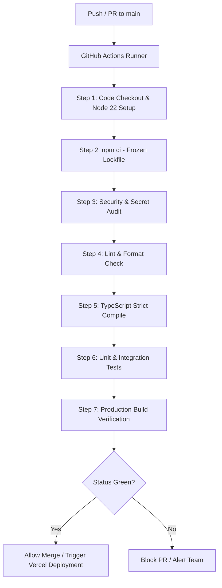

# Remediation Plan & Action Roadmap
## Phase 0B — AuraOne Cloud Audit

**Generated:** 2026-09-20  
**Auditor:** Antigravity (Lead Senior DevOps / Architect / Security / Platform Engineer)  
**Phase:** 0B — Audit & Risk Register

---

## 1. Overview & Strategy

This remediation plan translates findings from all Phase 0A and 0B audits into a sequenced, actionable roadmap. Remediation is strictly aligned with the phased delivery strategy (`05_AURAONE_PHASE_PLAN.md`), ensuring that security holes and developer bottlenecks are addressed before feature elaboration.

---

## 2. Target Testing Strategy & Workload Estimation

| Test Tier | Scope & Tooling | Target Coverage | Estimated Effort |
|---|---|:---:|:---:|
| **Unit Tests** | Vitest + React Testing Library: Pure functions, Zod schemas, token parsers, state reducers | 80%+ domain logic | **Medium** |
| **Integration Tests** | Vitest: Next.js API route handlers, Supabase mock adapters, SSE stream encoder/decoder | All critical paths | **Medium** |
| **E2E Tests** | Playwright: Google OAuth mock flow, chat stream completion, session switching, mobile drawer | Critical journeys | **Large** |
| **Accessibility Tests** | `@axe-core/playwright` + ESLint jsx-a11y: Contrast, ARIA tags, focus trapping | 100% WCAG 2.1 AA | **Small** |
| **Contract Tests** | Pact / JSON Schema validation: Next.js serverless payload ↔ Hermes VPS Gateway contract | 100% gateway schema | **Small** |

---

## 3. Supabase Readiness & Gap Analysis

```
┌─────────────────┐       ┌──────────────────────┐       ┌────────────────────────┐
│  Current State  │  ──►  │      The Gap         │  ──►  │      Target State      │
│  (Auth Only)    │       │  (Schema, RLS, Edge) │       │  (Full Multi-Tenant DB)│
└─────────────────┘       └──────────────────────┘       └────────────────────────┘
```

| Area | Current State | Target State | The Gap to Close | Target Phase |
|---|---|---|---|:---:|
| **Auth** | Working Google OAuth client-side | SSR cookie auth with middleware session protection | `@supabase/ssr` integration & `middleware.ts` | Phase 1 |
| **Database** | No AuraOne tables in Postgres | Full relational schema (`profiles`, `sessions`, `messages`, `credit_ledger`, `bots`) | Migration script pipeline & table definition | Phase 10 |
| **Row Level Security (RLS)** | None defined | Strict RLS ensuring `auth.uid() = user_id` for all tenant rows | RLS policy matrix definition & automated testing | Phase 10 |
| **Storage** | None configured | Secure buckets (`avatars`, `generated_media`) with signed URL access | Bucket definitions & storage access policies | Phase 10 |
| **Edge Functions** | None | Webhooks for payment gateway (Billplz) and background agent schedules | Deno/TypeScript Edge Functions | Phase 9 / 10 |
| **Migrations** | None (manual) | Declarative version-controlled SQL migrations in `supabase/migrations/` | Supabase CLI migration workflow setup | Phase 10 |
| **Environments** | Single production project used for local dev | Distinct Dev, Staging, and Production Supabase projects | Multi-project configuration & branch environments | Phase 1 / 10 |

---

## 4. Minimum Recommended CI/CD Pipeline Design

*(To be implemented in Phase 1 — Specification only)*



---

## 5. TOP 20 ACTIONS (Ranked Action Matrix)

Ranked rigorously by **(1) Risk Reduction, (2) Time To Fix, and (3) Architectural Importance**:

---

### P1: Secure `/api/chat` Route with Server-Side Auth Validation
* **Why:** Unauthenticated endpoints allow arbitrary external callers to abuse the Hermes AI engine, burning API costs and creating denial-of-service risks.
* **Risk if ignored:** Catastrophic financial cost or downtime from automated bots calling the endpoint.
* **Recommended Phase:** Phase 1

### P2: Enforce HTTPS / TLS Encryption on Hermes VPS Gateway
* **Why:** Communications currently travel over cleartext HTTP on port 9119 across public transit networks.
* **Risk if ignored:** User conversations, commercial strategies (Sakluma), and financial analysis are vulnerable to MITM interception.
* **Recommended Phase:** Phase 1

### P3: Redact Raw VPS IP Address from `.env.example` in Git
* **Why:** The raw server IP (`43.134.124.127:9119`) is published on public GitHub.
* **Risk if ignored:** Direct bypass of frontend application; attackers can target the VPS gateway directly.
* **Recommended Phase:** Phase 1 (Immediate)

### P4: Implement Rate Limiting on Chat API Routes
* **Why:** No throttling exists; any browser or script can trigger infinite concurrent LLM generations.
* **Risk if ignored:** Rapid exhaustion of Vercel Serverless execution budgets and Hermes VPS compute crash.
* **Recommended Phase:** Phase 1

### P5: Add Vitest Runner & Baseline Test Pipeline
* **Why:** Current test coverage is 0%; any code refactor or library update can cause silent production regressions.
* **Risk if ignored:** Breaks user authentication and chat streaming silently during deployments.
* **Recommended Phase:** Phase 1

### P6: Establish GitHub Actions CI Workflow
* **Why:** Code merges directly to `main` without automated linting, type-checking, or build verification.
* **Risk if ignored:** Defective builds get pushed live to Vercel production.
* **Recommended Phase:** Phase 1

### P7: Decompose Monolithic `page.tsx` (God Component)
* **Why:** A 657-line single component managing all app state and UI blocks future modular feature development.
* **Risk if ignored:** Extreme code brittleness, development gridlock, and unresolvable merge conflicts.
* **Recommended Phase:** Phase 2

### P8: Implement DEC-010 Adapter Interfaces for Chat & Auth
* **Why:** UI directly invokes vendor SDKs (`supabase`, `fetch`), preventing testing and vendor independence.
* **Risk if ignored:** Major rewrites required when switching storage models or updating LLM providers.
* **Recommended Phase:** Phase 4

### P9: Add Inbound Authentication (Secret Header / Bearer) to Hermes Gateway
* **Why:** Hermes currently accepts requests from any IP without verifying caller authorization.
* **Risk if ignored:** Unauthorized direct use of Hermes VPS tools, bypassing AuraOne billing.
* **Recommended Phase:** Phase 1

### P10: Add ARIA Labels to All Icon-Only Buttons
* **Why:** Core buttons (Send, Drawer, Close) cannot be read by screen reader assistive technologies.
* **Risk if ignored:** Hard accessibility barrier; fails basic WCAG 2.1 AA compliance.
* **Recommended Phase:** Phase 1

### P11: Add Focus Indicators and Drawer Focus Trap
* **Why:** Keyboard-only users have no visual feedback on interactive focus states.
* **Risk if ignored:** Renders keyboard navigation completely unusable for mobility-impaired users.
* **Recommended Phase:** Phase 1 / Phase 2

### P12: Deprecate `NEXT_PUBLIC_GATEWAY_URL` in Favor of Server-Only `HERMES_GATEWAY_URL`
* **Why:** `NEXT_PUBLIC_` variables are bundled into browser JavaScript, leaking internal endpoints.
* **Risk if ignored:** Internal gateway endpoint is permanently exposed to anyone viewing browser sources.
* **Recommended Phase:** Phase 1

### P13: Add Prettier Formatter and `.editorconfig`
* **Why:** Codebase lacks formatting standards, causing dirty git diffs across contributors.
* **Risk if ignored:** Unclean revision history and formatting friction.
* **Recommended Phase:** Phase 1

### P14: Pin Node.js Runtime to 22 LTS
* **Why:** No runtime engine is specified, creating risk of dev-prod version divergence.
* **Risk if ignored:** Subtle runtime errors when deployed on differing Vercel node runtimes.
* **Recommended Phase:** Phase 1

### P15: Forward Selected Agent Identifier to Hermes Gateway
* **Why:** The UI lets users choose from 6 agents, but the choice is never forwarded to the Hermes engine.
* **Risk if ignored:** Core product promise (specialized agent armada) fails silently in production.
* **Recommended Phase:** Phase 4

### P16: Implement AbortController on SSE Chat Streaming
* **Why:** Closing or re-submitting chat does not cancel active HTTP streaming connections.
* **Risk if ignored:** Memory leaks in browser and orphaned execution cycles on VPS.
* **Recommended Phase:** Phase 4

### P17: Remove Hardcoded Supabase Fallback URL in `lib/supabase.ts`
* **Why:** Code silently defaults to a hardcoded dev project URL if environment variables fail.
* **Risk if ignored:** Accidental connection to wrong environments or masked deployment errors.
* **Recommended Phase:** Phase 1

### P18: Introduce Global Error Boundaries (`error.tsx`, `global-error.tsx`)
* **Why:** Runtime errors cause complete white-screen crashes for users.
* **Risk if ignored:** Poor user experience without recovery options when exceptions occur.
* **Recommended Phase:** Phase 2

### P19: Replace Default Next.js `README.md` with Project Docs
* **Why:** New engineers and AI tools have no onboarding context from the root repository.
* **Risk if ignored:** Onboarding friction and accidental violation of architecture guidelines.
* **Recommended Phase:** Phase 1

### P20: Establish Separate Staging & Production Supabase Environments
* **Why:** Local development currently writes directly against production Supabase instances.
* **Risk if ignored:** Test runs and prototype experiments corrupt production user tables.
* **Recommended Phase:** Phase 1 / Phase 10

---

*End of Remediation Plan — Phase 0B*

